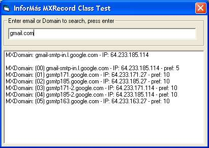



## im MX Record Class

### Description

This class make you know the MXrecords for a given email address or domain. The based code is not mine. It is based on some code from the web, specially in modMXQuery.bas from vbSendMail by Dean Dusenbery.

It wont freeze if you give a non-existent domain or DNS server, an improvement from original code.

Please see readme.txt file for references of based codes.
 
### More Info
 

             |
---                |---
**Submitted On**   |2005-08-30 00:00:04
**By**             |[Jorge Colaccini](https://github.com/Planet-Source-Code/PSCIndex/blob/master/ByAuthor/jorge-colaccini.md)
**Level**          |Intermediate
**User Rating**    |5.0 (10 globes from 2 users)
**Compatibility**  |VB 6\.0
**Category**       |[Internet/ HTML](https://github.com/Planet-Source-Code/PSCIndex/blob/master/ByCategory/internet-html__1-34.md)
**World**          |[Visual Basic](https://github.com/Planet-Source-Code/PSCIndex/blob/master/ByWorld/visual-basic.md)
**Archive File**   |[im\_MX\_Reco1928578292005\.zip](https://github.com/Planet-Source-Code/jorge-colaccini-im-mx-record-class__1-62382/archive/master.zip)

